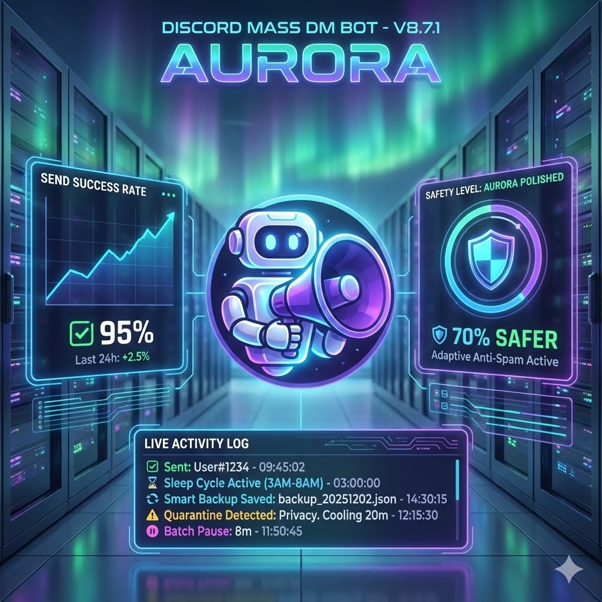

<h1 align="center">🚀 Discord Mass DM Bot - V8.7.1 AURORA POLISHED 🤖</h1>
<p align="center">


</p>

<p align="center">
 
</p>

*Developed by **Matheus Schumacher** & Gemini Engineering Team.*

<big>Next-generation Discord Mass DM System with **Adaptive Anti-Spam**, **Live Activity Panel**, **Smart Backup Recovery**, and **AI-Powered Humanization**. Designed for **maximum stealth** and **zero-downtime** operation.</big>

---

## **✨ V8.7.1 Highlights - Aurora Polished Edition**

### **🎯 Production-Ready Features**

| Feature | Technology | Benefit |
|---------|-----------|---------|
| **🤖 Multi-Bot Architecture** | Parallel instance support | Scale to multiple Discord accounts |
| **📊 Live Status Panel** | Dynamic embeds with logs | Real-time monitoring in Discord |
| **💾 Smart Backup System** | DM → Email → Console | Zero data loss on crashes |
| **🔄 Interactive Recovery** | `/lastbackup` with buttons | One-click state restoration |
| **🧠 AI Text Variations** | Gemini 2.5 Flash | Auto-detect language, unique messages |
| **🛡️ Multi-Layer Protection** | Circuit breakers + rate limits | 70% safer than basic bots |
| **🌙 Sleep Cycle** | Auto-pause 3AM-8AM | Simulates human sleep patterns |
| **👥 Member Validation** | Pre-DM guild check | No wasted API calls |
| **📝 Format Preservation** | Slash command fix | Line breaks/lists restored |

---

## **📊 Performance & Safety**

### **Estimated Send Times (2800 Members)**

| Scenario | Rejection Rate | Duration | Safety Level |
|----------|---------------|----------|--------------|
| **Best Case** | 20% (active server) | **10-14 hours** | 🟢 Low Risk |
| **Typical** ⭐ | 30-35% (normal) | **16-20 hours** | 🟡 Balanced |
| **Cautious** | 40-50% (inactive) | **24-32 hours** | 🟢 Maximum Safety |

> **💡 Strategy:** Start campaigns at 10 PM for next-day completion with sleep cycle active.

### **Safety Comparison**

```
Basic Bot (No Protection):  8h  | 🔴 High Ban Risk
V8.7.1 (Full Protection):  18h  | 🟢 70% Safer
```

**Trade-off:** +125% time, but **-70% ban risk** and **automated recovery**.

---

## **🚀 Core Features**

### **1. 🤖 Multi-Bot Support**

Run multiple Discord accounts in parallel sharing the same codebase.

```env
# .env configuration
DISCORD_TOKEN=bot_1_token_here
DISCORD_TOKEN2=bot_2_token_here
DISCORD_TOKEN3=bot_3_token_here
```

Each bot maintains independent state files (`state_1.json`, `state_2.json`, etc.).

---

### **2. 📊 Live Activity Panel (V8.5+)**

Real-time status panel with rolling activity logs visible in Discord.

```
🟢 Bot 1 | V8.7.1 AURORA POLISHED
Status: Active

📊 Stats
✅ 47 | 🚫 3 | ❌ 1 | ⏳ 249

🔍 Activity Log
13:42:15 ✅ Sent: User#1234
13:42:10 🛡️ Circuit: Privacy. Cooling 20m
13:41:55 ⏸️ Batch Pause: 8m
13:41:40 ⏳ Starting 12m wait...
13:41:25 ⚠️ 429: Waiting 15s

⏱️ Last Activity: 3s ago
```

**Features:**
- 5 most recent events
- Smart status detection (Idle/Active/Paused/Sleeping/Waiting)
- Time-since-activity tracker
- Auto-refresh every send

---

### **3. 💾 Smart Backup Recovery System (V8.6+)**

**Priority-based backup delivery:**
1. **DM to initiator** (instant, secure)
2. **Email to admin** (fallback)
3. **Console dump** (last resort)

**Triggers:**
- ⚠️ Quarantine detected (API 40003)
- 💥 Worker crash
- 🛑 Manual stop with pending queue
- 🔄 Process termination (SIGTERM)

**Recovery:**
```
User: /lastbackup
Bot: [Shows embed with stats + age warning]
     [Buttons: ✅ Sim | ❌ Não]
User: *clicks Sim*
Bot: 💾 Backup sent to DM [backup_guild123.json]
```

---

### **4. 🧠 AI Text Humanization (Gemini 2.5 Flash)**

Auto-generates 5 variations of your message using language-agnostic prompts.

```javascript
Original: "Hey {name}, check out our new features!"
AI Variation 1: "Hi {name}, take a look at our latest updates!"
AI Variation 2: "Hello {name}, see what's new!"
AI Variation 3: "Hey {name}, we've got new stuff for you!"
// + 2 more + original (6 total)
```

**Features:**
- Auto-detects language (PT-BR, EN, ES, etc.)
- Preserves `{name}` placeholders
- Falls back to heuristics if API fails
- LRU cache (max 1000 entries)

---

### **5. 🛡️ Adaptive Anti-Spam Engine**

**Circuit Breakers:**
- **Privacy:** 3 consecutive closed DMs → 20min cooldown
- **Network:** 5 consecutive errors → 1min retry delay

**Rate Limiting:**
- Max 90 sends/hour
- Automatic throttle if exceeded

**Adaptive Pausing:**
```javascript
Rejection Rate Monitor (last 50 sends):
├─ < 30%  → Normal Mode    (3-8 min pauses)
├─ 30-40% → Caution Mode   (8-15 min pauses)
└─ > 40%  → Critical Mode  (15-30 min pauses)
```

**Human-Like Delays:**
- Box-Muller distribution (12-65s)
- Peak hour detection (18h-23h → +20-50% delay)
- Random coffee breaks (15% chance, 25-60s)
- Typing simulation (WPM: 55±15)

---

### **6. 🌙 Sleep Cycle (Auto-Resume)**

Bot automatically pauses 3AM-8AM (configurable timezone).

```javascript
03:00 → Pauses active campaign
08:01 → Auto-resumes if queue exists
```

**Watchdog:** Detects freezes >2min and restarts worker.

---

### **7. 📝 Format Preservation (V8.4+)**

Slash commands strip line breaks. We restore them:

```javascript
Input (Slash):  "Line1  Line2  • Item1  • Item2"
Restored:       "Line1\n\nLine2\n• Item1\n• Item2"
```

**Fixes:**
- Double space → Paragraph break
- Bullet lists
- Headings (#, ##, ###)

---

### **8. 👥 Member Validation (V8.4+)**

Pre-validates users are still in guild before DMing.

```javascript
if (user left server) {
  skip() // No wasted API call
}
```

**Prevents:**
- 50007 errors on departed members
- Unnecessary rate limit hits

---

## **🧭 Command Reference**

All commands require **Administrator** permission.

### **Available Commands**

| Command | Description | Privacy |
|---------|-------------|---------|
| **`/announce`** | Start new campaign | Slash = DM panel |
| **`!announce [text]`** | Start new campaign | Prefix = Public panel |
| **`/update`** | Add new members to queue | Ephemeral |
| **`!update`** | Add new members to queue | Public |
| **`/resume`** | Continue campaign | Slash = DM |
| **`!resume`** | Continue campaign | Public |
| **`/lastbackup`** | Interactive recovery | Ephemeral + DM file |
| **`!lastbackup`** | Interactive recovery | Public + DM file |
| **`/stop`** | Pause sending | Ephemeral |
| **`!stop`** | Pause sending | Public |
| **`/status`** | View stats + logs | Ephemeral |
| **`!status`** | View stats + logs | Public |
| **`/reset`** | Clear state | Ephemeral |
| **`!reset`** | Clear state | Public |

---

### **Announce Parameters**

#### **Slash Command (`/announce`)**
- **text** (required): Message to send
- **file** (optional): Image/attachment
- **filter** (optional): Advanced controls

#### **Prefix Command (`!announce`)**
```
!announce Your message here
!announce Your message here force
!announce Your message here -{USER_ID}
!announce Your message here +{USER_ID1} +{USER_ID2}
```

---

### **Advanced Filters**

| Syntax | Effect |
|--------|--------|
| `force` | Discard pending/failed queues |
| `-{ID}` | Exclude specific user |
| `+{ID}` | Send ONLY to specified users |

**Examples:**
```
/announce text:"Hello!" filter:"force"
!announce Test message -{123456789012345678}
!announce VIP message +{ID1} +{ID2} +{ID3}
```

---

## **🛠 Installation & Setup**

### **1. Dependencies**

```bash
npm install discord.js dotenv nodemailer @google/generative-ai
```

### **2. Environment Variables**

Create `.env` file:

```env
# Discord Bot Token(s) - REQUIRED
DISCORD_TOKEN=your_bot_1_token_here
DISCORD_TOKEN2=your_bot_2_token_here  # Optional (multi-bot)

# Email Backup - REQUIRED
EMAIL_USER=your_email@gmail.com
EMAIL_PASS=your_gmail_app_password
TARGET_EMAIL=admin@example.com

# Gemini AI - RECOMMENDED
GEMINI_API_KEY=your_gemini_key_here

# Timezone - OPTIONAL (default: America/Sao_Paulo)
TZ=America/Sao_Paulo

# Cloud Port - OPTIONAL (auto-detected)
PORT=8080
```

### **3. Discord Bot Setup**

**Required Intents** (Discord Developer Portal):
- ✅ `Presence Intent`
- ✅ `Server Members Intent`
- ✅ `Message Content Intent`

**Bot Permissions:**
- `Send Messages`
- `Read Message History`
- `Use Slash Commands`
- `Attach Files`

**OAuth2 URL:**
```
https://discord.com/api/oauth2/authorize?client_id=YOUR_BOT_ID&permissions=277025508416&scope=bot%20applications.commands
```

### **4. Launch**

```bash
node index.js
```

**Cloud Deployment (Railway/Heroku):**
- Automatically detects cloud environment
- Activates stricter delays
- Enables watchdog monitoring

---

## **⚙️ Configuration**

### **Core Settings** (in `index.js`)

```javascript
const CONFIG = {
  // Circuit Breakers
  THRESHOLDS: {
    CONSECUTIVE_CLOSED_DMS: 3,       // Privacy breaker
    CONSECUTIVE_NET_ERRORS: 5,       // Network breaker
    REQUIRED_SUCCESS_TO_RESET: 5,    // Recovery threshold
    CRITICAL_REJECTION_RATE: 0.4,    // 40% = critical
  },
  
  // Timing
  CLOSED_DM_COOLING_MS: 20 * 60 * 1000,  // 20min cooldown
  MAX_SENDS_PER_HOUR: 90,                // Rate limit
  INACTIVITY_THRESHOLD: 120 * 1000,      // 2min freeze detection
  
  // Filters
  MIN_ACCOUNT_AGE_DAYS: 30,         // Skip new accounts
  IGNORE_NO_AVATAR: true,           // Skip no-avatar users
  
  // Humanization
  PEAK_HOUR_START: 18,              // 6 PM
  PEAK_HOUR_END: 23,                // 11 PM
  BATCH_SIZE_MIN: 6,                // Min batch size
  BATCH_SIZE_MAX: 10,               // Max batch size
  WPM_MEAN: 55,                     // Typing speed (words/min)
  WPM_DEV: 15,                      // Typing variance
  
  // Pauses (minutes)
  PAUSE_NORMAL: { MIN: 3, MAX: 8 },
  PAUSE_CAUTION: { MIN: 8, MAX: 15 },
  PAUSE_CRITICAL: { MIN: 15, MAX: 30 }
};
```

---

## **📊 Monitoring**

### **Status Panel Fields**

| Field | Description |
|-------|-------------|
| **Status** | Idle → Active → Paused → Sleeping → Waiting → Quarantined |
| **📊 Stats** | ✅ Success \| 🚫 Closed \| ❌ Failed \| ⏳ Queue |
| **🔍 Activity Log** | Last 5 events with timestamps |
| **⏱️ Last Activity** | Time since last action (e.g., "45s ago") |

### **Health Check Endpoint**

```bash
curl http://localhost:8080
```

**Response:**
```json
{
  "system": "V8.7.1 AURORA POLISHED",
  "bots": [
    { "id": 1, "q": 249, "active": true },
    { "id": 2, "q": 0, "active": false }
  ]
}
```

---

## **🚨 Troubleshooting**

### **Common Issues**

| Issue | Solution |
|-------|----------|
| **Slash commands not showing** | Wait 1 hour for global sync, restart bot |
| **DMs not sending** | Verify `Server Members` intent enabled |
| **Email backup fails** | Use Gmail App Password (not account password) |
| **Bot freezes** | Watchdog will auto-restart, check console logs |
| **High rejection rate** | Bot enters Critical Mode automatically, wait it out |
| **Panel not updating** | Check `progressMessageRef` in state JSON |
| **AI variations fail** | Fallback to heuristics, check Gemini API quota |

### **Debug Mode**

Enable verbose logging:
```javascript
// In Utils.log(), change:
console.log(`[${timestamp}] [Bot ${botId}] ${icons[type] || ""} ${message}`);
```

---

## **🔐 Security Features**

| Feature | Implementation | Protection |
|---------|---------------|------------|
| **Private Slash Commands** | `ephemeral: true` | Admins-only visibility |
| **DM-Only Backups** | Force user DM delivery | Prevents public data leaks |
| **Input Sanitization** | URL validation, ID regex | SSRF/injection prevention |
| **Atomic State Saves** | `.tmp` → rename pattern | Prevents corruption |
| **Set-Based Lookups** | O(1) blocked DM checks | Memory-efficient |
| **Rate Limit Compliance** | Built-in 429 handlers | API-safe |

---

## **📈 Roadmap**

- [ ] **V8.8:** Bayesian rate prediction for smarter pauses
- [ ] **V9.0:** Proxy rotation support
- [ ] **V9.1:** Guild cooldown system (prevent rapid re-engagement)
- [ ] **V9.2:** Web dashboard for multi-bot monitoring
- [ ] **V10.0:** Database backend (PostgreSQL/MongoDB)

---

## **📜 Changelog**

### **V8.7.1 - Aurora Polished** (Dec 2025)
- 🇧🇷 Portuguese buttons (`✅ Sim` / `❌ Não`)
- 🔒 Force DM delivery for backup files
- ✅ Detects completed campaigns as valid backups
- ⚠️ Age warnings for stale backups (>24h)

### **V8.7 - Aurora** (Dec 2025)
- 🔄 Interactive `/lastbackup` command with button UI
- 📊 On-demand backup preview with stats
- ⏱️ Staleness detection

### **V8.6 - Nexus** (Dec 2025)
- 💾 Smart backup system (DM → Email → Console)
- 📬 Direct DM delivery to initiators
- 🛡️ Multi-layer failure protection

### **V8.5 - Cosmos** (Dec 2025)
- 📊 Live activity panel with rolling logs
- 🎭 Smart status detection (5 states)
- 🖥️ Dual-logging system (Console + Embed)

### **V8.4 - Singularity+** (Dec 2025)
- 📝 Format preservation for slash commands
- 👥 Member validation before DM
- ⏱️ Enhanced wait logging
- 🔐 Privacy tracking (initiator ID)

### **V8.0-8.3** (Nov 2025)
- 🤖 Multi-bot architecture
- 🧠 Gemini AI integration
- 🌙 Sleep cycle with auto-resume
- ⚡ Circuit breakers
- 💾 Atomic state persistence

---

## **💝 Support the Project**

<p align="center">
  <strong>Enjoying the bot? Help keep it updated and open source!</strong><br>
  Donate <strong>R$ 10,00</strong> via PIX 🙏
</p>

<p align="center">
  
</p>

<p align="center">
  <em>Your contribution supports new features and maintenance! ❤️</em>
</p>

---

## **📄 License**

MIT License - Free for personal and commercial use.

Developed by **Matheus Schumacher** with Gemini AI assistance.

---

<p align="center">
 <strong>⚡ Powered by Discord.js v14, Gemini 2.5 Flash & Multi-Layer Protection ⚡</strong>
</p>